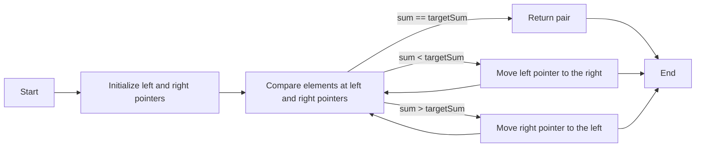

The Two Pointers technique is a popular approach used to solve many problems in Data Structures and Algorithms, especially those related to arrays, linked lists, and strings. It's a simple yet powerful technique that can help you solve problems efficiently.

**What is the Two Pointers technique?**

The Two Pointers technique involves using two pointers, typically starting from the beginning and end of an array, string, or linked list. The pointers move towards each other, and the algorithm performs some operation based on the elements at the current positions of the pointers.

**Why use the Two Pointers technique?**

The Two Pointers technique is useful for several reasons:

1.  **Reduced time complexity**: By using two pointers, you can reduce the time complexity of your algorithm from O(n^2) to O(n), where n is the size of the input array or string.
2.  **Simplified code**: The Two Pointers technique often leads to simpler code, as you only need to maintain two pointers and perform operations based on the elements at their positions.
3.  **Efficient memory usage**: This technique typically requires minimal extra memory, making it suitable for large inputs.

**Types of Two Pointers techniques:**

There are several types of Two Pointers techniques, including:

1.  **Opposite direction pointers**: The two pointers start from opposite ends of the array or string and move towards each other.
2.  **Same direction pointers**: The two pointers start from the same end of the array or string and move in the same direction.
3.  **Sliding window pointers**: The two pointers represent a sliding window that moves over the array or string, performing operations on the elements within the window.

**Example problems and solutions:**

Here are a few example problems that can be solved using the Two Pointers technique:

### Problem 1: Pair with Given Sum

Given an array of integers and a target sum, find a pair of elements that add up to the target sum.

**Java Solution:**
```java
public class PairWithGivenSum {
    public static void findPair(int[] arr, int targetSum) {
        Arrays.sort(arr);
        int left = 0;
        int right = arr.length - 1;
        while (left < right) {
            int currentSum = arr[left] + arr[right];
            if (currentSum == targetSum) {
                System.out.println("Pair found: (" + arr[left] + ", " + arr[right] + ")");
                return;
            } else if (currentSum < targetSum) {
                left++;
            } else {
                right--;
            }
        }
        System.out.println("No pair found");
    }

    public static void main(String[] args) {
        int[] arr = {1, 2, 3, 4, 5};
        int targetSum = 7;
        findPair(arr, targetSum);
    }
}
```

### Problem 2: Remove Duplicates from Sorted Array

Given a sorted array of integers, remove duplicates and return the length of the resulting array.

**Java Solution:**
```java
public class RemoveDuplicates {
    public static int removeDuplicates(int[] arr) {
        if (arr.length == 0) {
            return 0;
        }
        int writeIndex = 1;
        for (int readIndex = 1; readIndex < arr.length; readIndex++) {
            if (arr[readIndex] != arr[readIndex - 1]) {
                arr[writeIndex] = arr[readIndex];
                writeIndex++;
            }
        }
        return writeIndex;
    }

    public static void main(String[] args) {
        int[] arr = {1, 1, 2, 2, 3, 4, 4, 5};
        int length = removeDuplicates(arr);
        System.out.println("Length of resulting array: " + length);
    }
}
```

### Problem 3: Merge Two Sorted Arrays

Given two sorted arrays of integers, merge them into a single sorted array.

**Java Solution:**
```java
public class MergeSortedArrays {
    public static int[] mergeArrays(int[] arr1, int[] arr2) {
        int[] result = new int[arr1.length + arr2.length];
        int i = 0;
        int j = 0;
        int k = 0;
        while (i < arr1.length && j < arr2.length) {
            if (arr1[i] <= arr2[j]) {
                result[k] = arr1[i];
                i++;
            } else {
                result[k] = arr2[j];
                j++;
            }
            k++;
        }
        while (i < arr1.length) {
            result[k] = arr1[i];
            i++;
            k++;
        }
        while (j < arr2.length) {
            result[k] = arr2[j];
            j++;
            k++;
        }
        return result;
    }

    public static void main(String[] args) {
        int[] arr1 = {1, 3, 5};
        int[] arr2 = {2, 4, 6};
        int[] result = mergeArrays(arr1, arr2);
        System.out.println("Merged array: " + Arrays.toString(result));
    }
}
```

### Mermaid Diagrams

Here's a simple mermaid diagram illustrating the Two Pointers technique for the Pair with Given Sum problem:

This diagram shows the basic steps involved in the Two Pointers technique:

1.  Initialize the left and right pointers.
2.  Compare the elements at the left and right pointers.
3.  If the sum is equal to the target sum, return the pair.
4.  If the sum is less than the target sum, move the left pointer to the right.
5.  If the sum is greater than the target sum, move the right pointer to the left.

By following these steps, you can efficiently find a pair of elements that add up to the target sum.

The Two Pointers technique is a versatile approach that can be applied to various problems. By understanding how to use this technique, you can improve your problem-solving skills and become more efficient in solving algorithms and data structure problems.